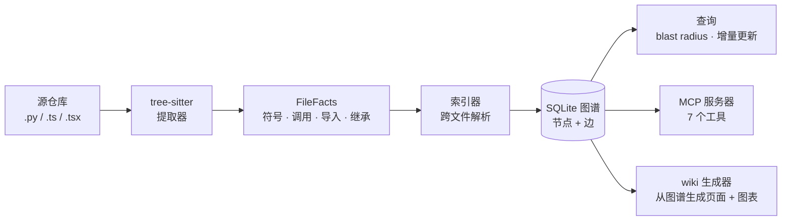

# repopedia

[](https://pypi.org/project/repopedia/)
[](https://github.com/bolongpa/repopedia/stargazers)
[](LICENSE)
[](https://pypi.org/project/repopedia/)
[](https://modelcontextprotocol.io/)

[English](README.md) · [画廊](docs/gallery.md) · [Agent Skill](SKILL.md)


**代码的本质是一张图——调用、依赖、继承——但今天的 AI 文档工具都在假装它是文本。** repopedia 先恢复结构（AST → 知识图谱），再从图谱上长出问答、wiki 和影响分析。图谱负责"说得对"（每个断言都引用 file:line）；LLM 负责"写得好看"。

repopedia 是 MIT 协议、本地优先、依赖极简：`pip install` 就能索引任何仓库。不需要 Docker，不需要服务器，不绑定任何厂商。

> 上图是 repopedia 给自己生成的：用 `repopedia wiki` 跑本仓库，从它产出的模块依赖 Mermaid 图渲染而来。从第一天就开始自己吃自己的狗粮。

## 为什么是图，而不是文本块

朴素的代码理解把源文件切块、做向量嵌入、检索 top-k 最相似的块。这对*"重试逻辑在哪？"*管用——答案就在一个块里。但对结构性问题会失效，比如：

> *如果我改了 `Engine.run`，会炸掉什么？*

没有任何一个块包含答案。你需要调用图：谁调用了 `run`，谁又调用了*它们*，以此类推。向量相似度做不了图遍历；知识图谱可以。repopedia 用 tree-sitter（精确的、语言感知的解析——不是正则）建这张图，然后从图上作答。

## 架构



## 查询图谱

```bash
cd ./myrepo
repopedia query callers pkg.mod.Service.run     # 谁调用了它（带 file:line）
repopedia query callees pkg.mod.Service.run     # 它调用了谁（未解析的显示为 <unresolved: raw>）
repopedia query inherits pkg.mod.Service        # 基类，最近的在前
repopedia query file pkg/mod.py                 # 一个文件里定义的所有符号
repopedia blast-radius pkg.mod.Service.run --depth 3
repopedia search "retry handler"                 # BM25 + 一跳图扩展
```

`blast-radius` 回答*"如果我改了这里，会炸掉什么？"*：反向 `calls` 边传递闭包（`--depth` 控制深度），加上所有导入了该符号所在文件的文件。每个命中都带 `file:line` 和到达路径（`calls(2)`、`imports`…）。任何命令加 `--json` 输出机器可读格式——Week 3 的 MCP 服务器用的就是同一套函数。

Python API（所有返回值都是纯 JSON 可序列化的 dict/list）：

```python
from repopedia.store import open_store
from repopedia import query

with open_store("myrepo/.repopedia/graph.db") as s:
    for hit in query.blast_radius(s, "pkg.mod.Service.run", depth=3):
        print(hit["depth"], hit["via"], hit["qualified_name"],
              f"{hit['file']}:{hit['line_start']}")
```

## 增量更新

```bash
repopedia update ./myrepo
# updated: +1 added, ~2 modified, -0 deleted
```

`update` 对比图谱构建时的 commit（以 `head_sha` 存在 DB 里）和当前 HEAD 的 diff，只重新提取变更的文件，并在全图范围内重新解析它们的边。指向*变更文件*的文件（调用者、导入者）也会被修复引用。非 git 目录降级为全量重建并警告。一个诚实的局限：变更文件之外的旧的*未解析*边，要等下次全量 `repopedia index` 才会修复。

## MCP 服务器：给 AI 编程智能体的图谱

图谱的第二个消费者不是人——是你的编程智能体。`repopedia mcp` 通过 Model Context Protocol（stdio）提供查询 API，Cursor、Claude Code、Windsurf 或任何 MCP 客户端都能做结构化遍历，而不是靠文本搜索瞎猜。

```bash
repopedia mcp --repo ./myrepo
# repopedia MCP server: ./myrepo/.repopedia/graph.db (stdio)
```

LLM 是可选的：只有 `ask_codebase` 会合成自然语言，而且只在设置了 `REPOPEDIA_LLM_BASE_URL` / `REPOPEDIA_LLM_API_KEY` / `REPOPEDIA_LLM_MODEL`（任何 OpenAI 兼容 endpoint）时。其余工具全部离线、直接读图。

| 工具 | 功能 |
|---|---|
| `find_symbol` | 按全名/短名找符号，每个都引用 `file:line` |
| `get_callers` / `get_callees` | `calls` 边单跳，双向（未解析的调用点会标注） |
| `blast_radius` | 反向调用传递闭包 + 导入该文件的文件（`depth` 参数） |
| `search_codebase` | BM25 + 一跳图扩展，按 `via: lexical\|graph` 排序 |
| `get_file_symbols` | 一个文件定义的所有符号 |
| `ask_codebase` | 检索 + 有依据的合成；没配 LLM 时只返回证据块并明说 |

客户端配置：

```bash
# Claude Code CLI
claude mcp add repopedia -- repopedia mcp --repo /path/to/repo
```

```jsonc
// Cursor / Windsurf / Claude Desktop — mcpServers
{
  "repopedia": {
    "command": "repopedia",
    "args": ["mcp", "--repo", "/path/to/repo"]
  }
}
```

## Agent skill：教你的编程智能体什么时候查图

MCP 服务器是*机器*接口。[Agent skill](SKILL.md) 是*指令*层：它教 Claude Code（或任何支持 skill 的智能体）**什么时候**该用 repopedia、什么时候该用 ripgrep、什么时候该用向量 RAG，一页纸讲清 7 个工具，并把诚实局限写在前面——让智能体在结构性问题上走图遍历，而不是 grep 瞎猜。

```bash
# Claude Code：项目级 skill
mkdir -p .claude/skills && cp /path/to/repopedia/SKILL.md .claude/skills/repopedia.md

# 或全局
cp /path/to/repopedia/SKILL.md ~/.claude/skills/repopedia.md
```

Skill 会被加载进智能体的上下文，所以文件故意写得很紧凑：一张决策表（结构问题 → repopedia，语义问题 → LLM，精确字符串 → ripgrep）、7 个工具一句话版、CLI、局限。见 [SKILL.md](SKILL.md)。

## Wiki 生成器：从图谱派生的文档

```bash
repopedia wiki ./myrepo --out docs/
# wiki written to ./myrepo/docs
#   architecture.md
#   index.md
#   modules/auth.md
#   ...
```

这是反 DeepWiki 的打法：不是让 LLM 读文本块写看似合理的散文，而是**从图谱边生成**页面——模块表来自 `defines`，依赖列表来自 `imports`，架构图来自真实的导入图，"被调用最多函数"来自真实的调用计数。每个结构性断言都引用 `file:line`；超出节点上限的 Mermaid 图会在页面上明说。

生成前，repopedia 会对比图谱的 `head_sha` 和 git HEAD。如果图谱过期了，它会打印警告*并且*把警告嵌进 `index.md`——可能过时的 wiki 会大声说出来，而不是悄悄撒谎。（先跑 `repopedia update`；注意：未变更文件里的旧未解析引用要全量重建才会修复。）

配了 LLM（和上面一样的环境变量）时，`index.md` 和模块页会得到受严格"只引用给定事实"约束的短 prose 总结。没配时，你得到的是确定性结构 wiki——表格加图表、零 prose 断言——本身就很好用：它用引用回答"什么东西在哪"。同一张图 → 字节级相同的 markdown，每次都一样。

## 精美图表：搭配 archify

repopedia 的图表是*真实*的——每条边都来自代码图谱——但原生 Mermaid 不好看。要做演示级的输出，把 Mermaid 交给 [archify](https://github.com/tt-a1i/archify)（74k star，MIT），它能把粘贴进去的 Mermaid 变成精美的交互式 HTML 图表。分工很干净：**repopedia 保证图是真的；archify 负责让它好看。**

```bash
# 1. 生成 wiki（图表包含在内）
repopedia wiki ./myrepo --out docs/

# 2. 从 docs/architecture.md 复制任意 ```mermaid 代码块

# 3. 粘贴进 archify → 导出精美的交互式 HTML
```

这招管用，是因为 repopedia 的 Mermaid 是*派生*出来的，不是编出来的：把 LLM 幻觉出来的图粘进美化器，得到的只是更好看的谎言。

## 搜索：BM25 + 图，不用向量（故意的）

代码标识符不是自然语言。`"where is retry handled"` 更适合这样答：先匹配符号 `retry` / `handle_retry`，再*沿图走*（谁调用它、它在哪个文件），而不是把查询嵌入到一个在散文上训练的向量空间里。所以 `repopedia search` 用手写的 BM25（约 40 行，零依赖）在全名、文件路径、类型上排序，再沿 `calls` / `inherits` / `imports` 扩展一跳，把结构相关的符号拉进来——输出里标为 `"via": "graph"`。对"在哪"类问题，结构胜过向量；向量以后可能作为补充加进来。

## 快速开始

```bash
pip install repopedia        # 或从源码：pip install -e .
repopedia index ./myrepo
# indexed ./myrepo
#   db:      ./myrepo/.repopedia/graph.db
#   files:   132 parsed, 1 skipped
#   symbols: 841
#   edges:   2130
```

只索引一种语言，或指定 DB 位置：

```bash
repopedia index ./myrepo --language py
repopedia index ./myrepo --db /tmp/graph.db
```

Python API：

```python
from repopedia.store import open_store

with open_store("myrepo/.repopedia/graph.db") as s:
    for sym in s.find_symbol("Engine.run"):
        print(sym["qualified_name"], sym["file"], sym["line_start"])
    for e in s.in_edges(sym["id"], kind="calls"):   # 谁调用了 Engine.run？
        print("called by:", e["src_qualified"], e["src_file"])
```

## 提取能力

| 语言 | 扩展名 | 符号 | 边 |
|----------|-----------|---------|-------|
| Python | `.py` | 类、函数、方法（含装饰器/async/嵌套） | `defines`、`imports`（绝对+相对）、`calls`、`inherits` |
| TypeScript | `.ts`、`.tsx` | 类、函数、方法（含导出） | `defines`、`imports`（相对）、`calls`（+ `new`）、`inherits`（`extends`） |

跳过且永不致命：`node_modules/`、`.git/`、`venv/`、`__pycache__/`、`dist/`、`build/`、非 UTF-8 文件、语法错误的文件（记 warning 日志——tree-sitter 的错误恢复被刻意*不信任*，不做部分提取）。

### 图 schema

```sql
nodes(id, kind, name, qualified_name, file, line_start, line_end, language)
-- kind: file | class | function | method
-- qualified_name: 点分隔路径，如 "pkg.mod.Service.run"
-- file: 仓库相对路径；line_* 从 1 开始，闭区间

edges(src, dst, kind, data)
-- kind: defines | imports | calls | inherits
-- dst 为 NULL 表示仓库内解析不了的引用
-- data (JSON) 永远保留原始写法：
--   imports  -> {"module": "pkg.util"}
--   calls    -> {"raw": "helper"}（歧义时 + "candidates": N）
--   inherits -> {"raw": "Base"}
```

**解析规则（启发式，已文档化）：**
- *calls*：仓库内名字唯一时按短名解析。`self.x` / `this.x` 匹配方法 `x`；`ClassName(...)` 解析到类节点（构造调用）。歧义或未知的名字保持 `dst=NULL`，原始写法保留给后续阶段 refine。
- *imports*：按常规模块解析规则（`pkg/util.py`、`__init__.py`、`./util` → `util.ts(x)`/`index.ts(x)`）。标准库、第三方、裸 specifier 保持未解析，模块字符串记下来。
- *inherits*：基类名在仓库内唯一时解析。

Schema 是稳定的：Week 2（查询 API、blast-radius = 反向 `calls` 遍历、git-diff 增量重建）和 Week 3（MCP 工具、从图谱生成带 file:line 引用的 wiki 页面 + Mermaid 图）都建在这几张表上。

## 路线图

- **Week 1** ✅：tree-sitter 索引器（Python + TypeScript）、SQLite 存储、CLI
- **Week 2** ✅：查询 API（callers/callees、blast radius、继承、文件符号）、git-diff 增量重建（含引用修复）、BM25 + 图混合检索
- **Week 3** ✅：MCP 服务器（7 个工具：find_symbol、get_callers/callees、blast_radius、search_codebase、get_file_symbols、ask_codebase，LLM 合成可选且有依据）、wiki 生成器（index + 按模块页面 + architecture，全部从图谱派生、带 file:line 引用、确定性输出、过期警告）
- **以后**：更多语言（Go、Java、Rust）、向量嵌入作为可选补充、在线 demo

## repopedia 不是什么

- **不是向量 RAG 克隆。** MVP 里没有 embedding——故意的。结构优先，向量以后作为补充。
- **不是 DeepWiki 克隆。** DeepWiki 系工具从文本块生成散文；repopedia 从*图谱*生成。地基不同，准确性也不同：我们的 wiki 页面最多错在解析器，永远不会错在 LLM 的幻觉上。
- **不是 IDE。** 图谱服务于两类消费者：读生成 wiki 的人，和通过 MCP 查询的 AI 编程智能体。
- **不是魔法。** 未解析的引用（`dst=NULL`）会展示出来，不藏着。过期的图谱会大声警告。LLM 被要求只引用图谱给它的东西——没配 LLM 时，repopedia 会明说，而不是假装合成了。

## 许可证

MIT —— 拿去公司用、装进产品卖，都可以，没有附加条件。见 [LICENSE](LICENSE)。
