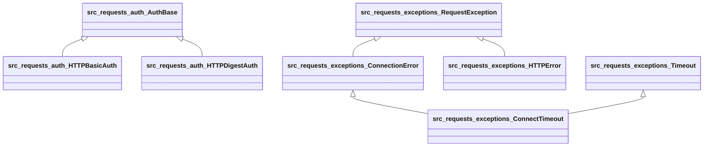

# Gallery: repopedia on `psf/requests`

Live proof, generated entirely by repopedia with **no LLM involved** — pure graph extraction. Reproduce it yourself:

```bash
git clone https://github.com/psf/requests /tmp/req
repopedia index /tmp/req
repopedia wiki /tmp/req --out /tmp/req-wiki
```

Index stats: **37 files parsed, 793 symbols, 3,624 edges** (Python only).

---

## 1. The exception hierarchy, for free

The class-inheritance diagram below is derived mechanically from `inherits` edges — no LLM, no guessing. It immediately shows requests' real design: one `RequestException` root, with `ConnectionError` → `ConnectTimeout` and `Timeout` → `ConnectTimeout` forming a diamond, plus `InvalidJSONError` → `JSONDecodeError` and `InvalidURL` → `InvalidProxyURL` specializations.





*(Excerpt — the full diagram has 40+ classes. Mermaid source above; paste it into [archify](https://github.com/tt-a1i/archify) for a beautified interactive version.)*

## 2. Load-bearing functions, by call count

"Most-called functions" comes from real in-repo `calls` edges — not vibes:

| Function | Callers | Location |
|---|---|---|
| `RequestsCookieJar.set` | 38 | `src/requests/cookies.py:229` |
| `Response.json` | 20 | `src/requests/models.py:1091` |
| `Session.mount` | 18 | `src/requests/sessions.py:888` |
| `session` (factory) | 17 | `src/requests/sessions.py:908` |
| `RequestsCookieJar.update` | 16 | `src/requests/cookies.py:391` |

Cookie handling is the quiet load-bearing wall of this codebase — 38 internal callers on `.set()` alone. That's the kind of thing you feel after a month in a repo; the graph tells you in seconds.

## 3. Blast radius: "what breaks if I change `RequestsCookieJar.set`?"

```bash
$ repopedia blast-radius src.requests.cookies.RequestsCookieJar.set
```

```
src.requests.cookies.RequestsCookieJar.set          cookies.py:229  [self]
src.requests.cookies.RequestsCookieJar.__setitem__  cookies.py:367  [calls(1)]
src.requests.cookies.create_cookie                  cookies.py:494  [calls(1)]
src.requests.adapters   adapters.py:1    [imports]
src.requests.auth       auth.py:1        [imports]
src.requests.models     models.py:1      [imports]
src.requests.sessions   sessions.py:1    [imports]
src.requests.utils      utils.py:1       [imports]
tests.test_lowlevel.test_chunked_upload              …  [calls(1)]
… (truncated)
```

Two direct callers, five importing modules, and the affected tests — each with `file:line` and *how* it was reached. No vector search can produce this; it requires the call graph.

## 4. Hybrid search: BM25 + one graph hop

```bash
$ repopedia search "retry"
```

```
src.requests.exceptions.RetryError        exceptions.py:142  [lexical] score=7.126
src.requests.exceptions.RequestException  exceptions.py:20   [graph]   score=3.563
src.requests.adapters.HTTPAdapter.send    adapters.py:634    [graph]   score=3.563
```

`RetryError` matches lexically; the graph hop then pulls in its parent `RequestException` and `HTTPAdapter.send` — where retries are actually *implemented*. The lexical hit answers "what's it called"; the graph answers "where does it live".

---

**The pattern:** every artifact above cites `file:line`, every edge corresponds to a real syntactic relationship in the code, and nothing was hallucinated. That's the whole product thesis: *the graph says what's true; the LLM makes it readable.*
